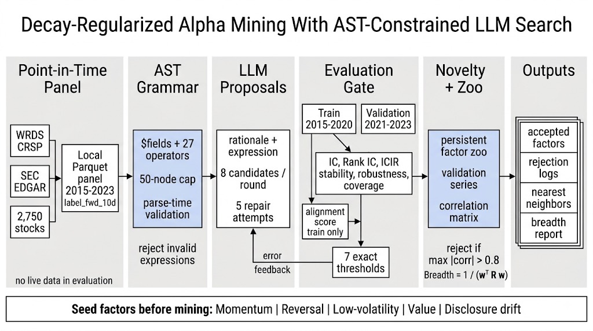

# Decay-Regularized Alpha Mining With AST-Constrained LLM Search

This project implements an LLM-agent alpha-mining framework for US equities using a mechanically constrained expression grammar, point-in-time market and fundamental data, and explicit regularization against redundant or structurally overfit signals. Candidate factors are represented as abstract syntax trees over fixed operators and fixed fields, not free-form code. Every expression is parsed, type-checked, complexity-limited, and evaluated against the same local point-in-time panel before any statistical acceptance decision is made.

The data layer materializes WRDS CRSP `dsf_v2` daily equity data and SEC EDGAR `companyfacts` fundamentals into a single `(datetime, instrument)` panel. The target universe is 2,750 US common stocks selected by CRSP market capitalization with continuous coverage over 2015-2023. Fundamental values become usable only from the first trading day strictly after their SEC filing date. Valuation ratios, disclosure-distance fields, market data, and the forward 10-trading-day return label are computed once during panel construction, then read locally by every downstream evaluation path.

The expression system exposes price, volume, market-cap, valuation, raw fundamental, and disclosure-timing fields through a fixed grammar of 27 operators. Time-series operators operate per instrument over trailing trading-day windows. Cross-sectional operators operate per trading date across finite instruments. Arithmetic, comparison, conditional, and event operators produce one numeric value per panel row when sufficient input data exists. The parser rejects unknown fields, unknown operators, wrong arity, invalid literal windows, undefined names, and candidates exceeding the 50-node AST cap before any panel computation runs.

Candidate evaluation uses a fixed train-validation protocol. Information coefficient, Rank IC, ICIR, lag-1 cross-sectional autocorrelation, monthly robustness, and coverage are computed separately on the training and validation windows. A separate LLM alignment call scores whether the candidate expression implements its stated economic rationale using only the rationale, parsed fields, parsed operators, expression text, and training-window IC sign and magnitude. Validation statistics are excluded from the alignment prompt.

Acceptance is an exact seven-part gate: minimum absolute IC, minimum absolute ICIR, lag-1 stability, monthly robustness, coverage, validation IC sign agreement with training IC, and minimum hypothesis-alignment score. A candidate that fails any criterion is rejected with recorded metrics. Accepted candidates pass through a novelty gate against the persistent factor zoo. Redundancy is measured by daily cross-sectional correlation against accepted validation-window factor series; candidates with maximum absolute correlation above 0.8 are rejected and their nearest zoo neighbors are logged.

The factor zoo stores each accepted expression, rationale, node count, full metric record, validation-window value series path, pairwise correlation matrix, and effective breadth. Breadth is computed as `1 / (w^T R w)` using equal weights and the stored zoo correlation matrix. The system therefore reports the effective number of independent accepted signals rather than the raw count of accepted formulas.

The run sequence evaluates five fixed seed factors before LLM mining begins: momentum, reversal, low-volatility, valuation, and post-disclosure drift. These seeds exercise price-driven, valuation-driven, and event-anchored signal paths through the same parser, evaluator, metric engine, alignment scorer, novelty gate, and zoo persistence layer used by generated candidates. The full mining loop proposes eight candidates per round, applies a five-attempt refinement cap for parse failures or all-NaN evaluations, and runs for the configured tier budget.
